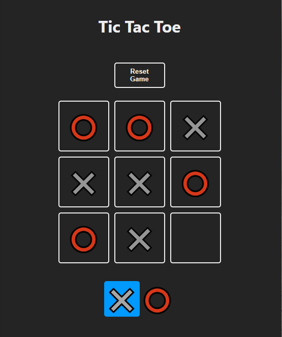
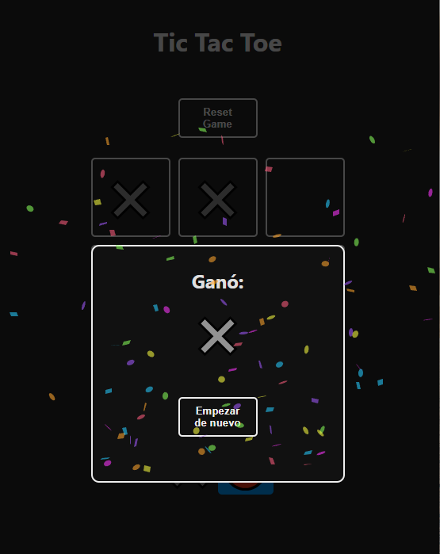

# 🎮 Tic Tac Toe – React

Juego clásico de **Tic Tac Toe (Tres en línea)** desarrollado con **React**, enfocado en una interfaz moderna, lógica clara de juego y una experiencia de usuario sencilla e intuitiva.

## 📸 Capturas de pantalla

### Tablero de juego


### Pantalla de victoria


## 🚀 Características

- Interfaz moderna con tema oscuro  
- Turnos dinámicos entre **X** y **O**  
- Detección automática de ganador  
- Animación de celebración al ganar  
- Botón para reiniciar la partida  
- Código simple y fácil de entender  

## 🛠️ Tecnologías utilizadas

- **React**
- **JavaScript (ES6+)**
- **HTML5**
- **CSS3**

## 📦 Instalación y ejecución

1. Clona el repositorio:
   ```bash
   git clone https://github.com/DeathbatO13/Tic-Tac-Toe-con-React.git
   ```

2. Entra al proyecto:
    ```bash
    cd Tic-Tac-Toe-con-React
    ```

3. Instala las dependencias:
    ```bash
    npm install
    ```
4. Ejecuta la aplicación:
    ```bash
    npm start
    ```

## 📁 Estructura del proyecto

    ├── src
    │   ├── components
    │   ├── App.js
    │   └── index.js
    ├── img
    │   ├── board.png
    │   └── win.png
    └── README.md

## 🎯 Objetivo del proyecto

Proyecto práctico para reforzar conceptos de:

- Manejo de estado en React
- Renderizado condicional
- Componentes reutilizables
- Lógica básica de juegos


